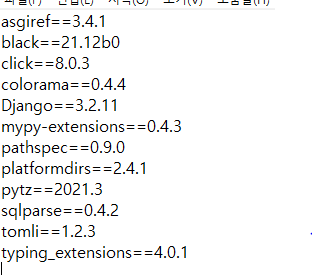

# pjt04 - 프레임워크 활용 웹페이지 구현


## git

* pip install -r requirements.txt
  - requirements.txt 안에 적혀 있는 것들 버전에 맞게 한번에 설치해줌.

* pip freeze > requirements.txt

  * 프로젝트에서 사용한 패키지들 텍스트파일로 다 정리해줌.

    


### ## urls -> views -> templates ##

### ## 하나씩 작업!! index 마무리 하고 reco 로


## settings.py

```python
INSTALLED_APPS = [
    'movies',
    'django.contrib.admin',
    'django.contrib.auth',
    'django.contrib.contenttypes',
    'django.contrib.sessions',
    'django.contrib.messages',
    'django.contrib.staticfiles',
]

TEMPLATES = [
    {
        'BACKEND': 'django.template.backends.django.DjangoTemplates',
        'DIRS': [BASE_DIR/'templates'],
        'APP_DIRS': True,
        'OPTIONS': {
            'context_processors': [
                'django.template.context_processors.debug',
                'django.template.context_processors.request',
                'django.contrib.auth.context_processors.auth',
                'django.contrib.messages.context_processors.messages',
            ],
        },
    },
]

```

```
앱 등록은 앱 생성 이후에!!!
기본이 되는 템플릿(앱 밖에 있는 템플릿) DIRS에 추가
```


## urls.py

```python
#pjt04/urls.py

from django.contrib import admin
from django.urls import path, include

urlpatterns = [
    path('admin/', admin.site.urls),
    path('movies/', include('movies.urls'))
]


# movies/urls.py

from django.urls import path
from . import views

app_name = 'movies'

urlpatterns = [
    path('', views.index, name='index'),
    path('recommendations/', views.recommendations, name='recommendations'),
    
]
```

```
movies app에서 urls 관리
pjt04/urls.py 에서 include로 접근
메인 페이지를 /movies/로 하기 위해 movies에 첫번째 path 공백
```


## views.index

```python
def index(request):
    context = {
        'movies' : [{'title':f'제목{i}', 'content' : f'내용{i}'} for i in range(1,7)]
    }
    
    return render(request, 'movies/index.html', context)
```

```
{'movies': [{'title': '제목1', 'content': '내용1'}, 
            {'title': '제목2', 'content': '내용2'},
            {'title': '제목3', 'content': '내용3'},
            {'title': '제목4', 'content': '내용4'},
            {'title': '제목5', 'content': '내용5'},
            {'title': '제목6', 'content': '내용6'}]}
            
            
render함수에서 'movies/index.html'  
index.html의 실제 경로는  movies/templates/movies/index.html 
						장고에서 movies/templates 까지는 알아서 처리해줌(?)
						앱이 여러개이고 템플릿명이 겹칠 수도 있어서 movies 폴더 하나 더 만들어주고 관리
```


## index.html

> include  ,  extends  이해부족으로 시작
>
> block tag 구동원리 이해부족으로 시작

```django

```


```django
###base.html

<!DOCTYPE html>
<html lang="ko">
<head>
  <meta charset="UTF-8">
  <meta http-equiv="X-UA-Compatible" content="IE=edge">
  <meta name="viewport" content="width=device-width, initial-scale=1.0">
  <link href="https://cdn.jsdelivr.net/npm/bootstrap@5.1.3/dist/css/bootstrap.min.css" rel="stylesheet" integrity="sha384-1BmE4kWBq78iYhFldvKuhfTAU6auU8tT94WrHftjDbrCEXSU1oBoqyl2QvZ6jIW3" crossorigin="anonymous">
  <title>Document</title>
</head>
<body>
  
  <div class="container">
    
    
  </div>
  
  <div class="mb-5"></div>
  <script src="https://cdn.jsdelivr.net/npm/bootstrap@5.1.3/dist/js/bootstrap.bundle.min.js" integrity="sha384-ka7Sk0Gln4gmtz2MlQnikT1wXgYsOg+OMhuP+IlRH9sENBO0LRn5q+8nbTov4+1p" crossorigin="anonymous"></script>
</body>
</html>
```

```
base.html 은 외부 templates에서 관리 
부트스트랩 cdn 하는 base가 되는 html

    ->   앱에서 관리하는 _nav.html 내용이 들어가는 곳
    ->   앱에서 관리하는 _footer.html 내용이 들어가는 곳

<div class="container">
    
                     ->   앱 안의 html 에서  하고 블록 태그 사용하면 내용이 base.html 블록 태그 										사이로 들어옴
```

> base.html에만 부트스트랩을 시작하였기 때문에 다른 html에서는 부트스트랩 바로바로 확인 불가능
>
> 하나하나 작동하는지 확인하면서 작업해야 나중에 오류 발견하기 쉬움
>
> **완벽하게 만들고 서버돌릴 생각 말고 돌아가는지 확인하기 위해 간단하게 작성하고 확인부터**

Q. base.html 에 cdn 하면 include 할 html 에서는 부트스트랩 확인을 못하는건가?

A. 


```django

    <div class="card col-12 col-sm-4 col-md-3 col-lg-2 m-3" style="width: 18rem;">
      <button type="button" class="btn p-0" data-bs-toggle="modal" data-bs-target="#exampleModal">
        
      </button>
      <div class="card-body">
        <h5 class="card-title">{{ movie.title }}</h5>
        <p class="card-text">Some quick example text to build on the card title and make up the bulk of the card's content.</p>
      </div>
	</div>

```

```
movie 는 딕셔너리 
movie 의 title 키 값으로 접근
```

>처음에 movie.get('title') 로 접근함.
>
>**html 파일은 파이썬이 아니다.**
>
>장고 html 에서 키값 접근은 **movie.title**
>
>modal은 아직도 잘 모르겠음


## views.recommendations

> url = BASE_URL + path + parameters
>
> json 파일 받을 때 requests 필수

```python
from django.shortcuts import render
import requests
import random

 url = 'https://api.themoviedb.org/3/movie/278/recommendations'
    param={
        'api_key' : '7f292cc09a9aff763e3e54a81c1ec05a',
        'region': 'KR',
        'language': 'ko'
    }
    res = requests.get(url, params=param).json()
    movie = random.choice(res.get('results'))
    .
    .
    .
    .
    context = {
        'res' : res,
        'movie' : movie,
        'pic' : pic,
        'path' : path,
        'picture' : picture,
        'overview' : overview,
        'title' : title,
        'release_date' : release_date,
        'vote_average' : vote_average
    }
    return render(request,'movies/recommendations.html', context)
```

```
context는 항상 딕셔너리   ->  키값을 받아서 value 값으로 처리해야 하니깐
```

> json viewer 는 json파일 형식에서만 작동.
>
> html 형식에서는 작동 x


## recommendations.html

```django




<h1 class="text-center m-5">쇼생크 탈출 과 비슷한 영화 추천받기</h1>
<div class="card flex-row row" style="">
  <div class="col-12 col-md-6 col-lg-4 ">
    
  </div>
  <div class="card-body col-12 col-md-6 col-lg-8 ">
    <h5 class="card-title">{{ title }}<span class="m-2 badge bg-success">{{ vote_average }}</span></h5>
    <p class="card-text">{{ overview }}</p>
    <p>개봉일 : {{ release_date }}</p>
    <button type="button" class="btn btn-info w-100">상세정보</button>
  </div>
</div>


```

```
block tag 사이의 내용이 base.html 로 들어가서 base.html 을 출력
```

>card 클래스는 direction-column이므로 flex-row 해주어야 그리드 표현 가능.


